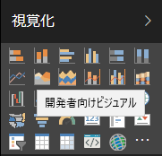
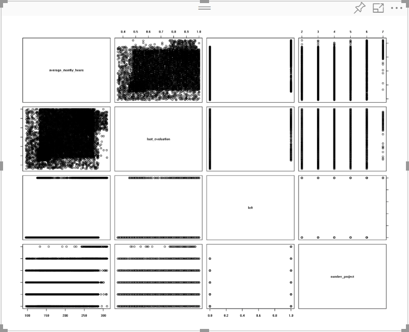
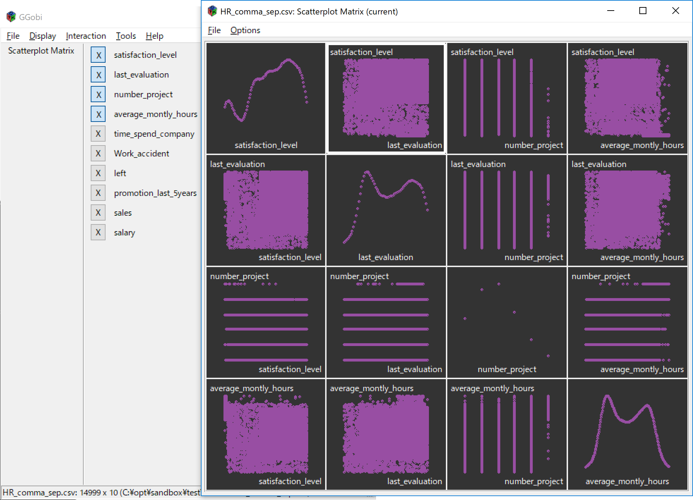
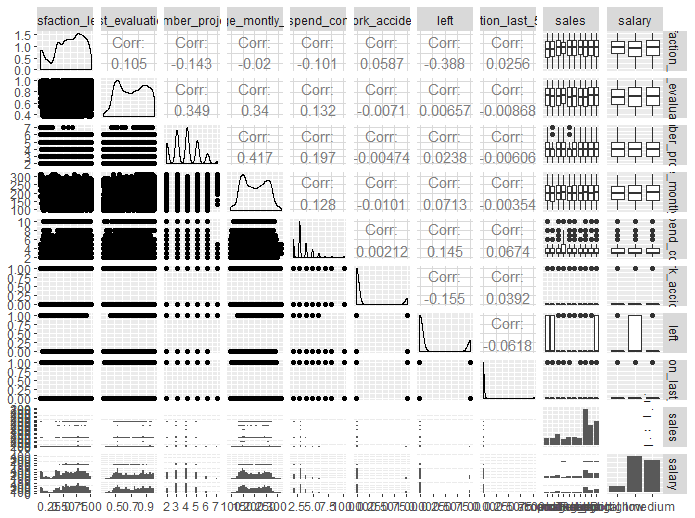
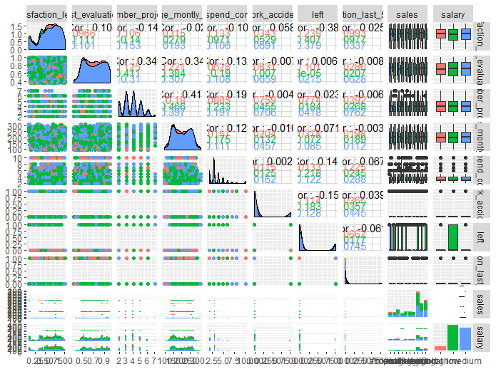
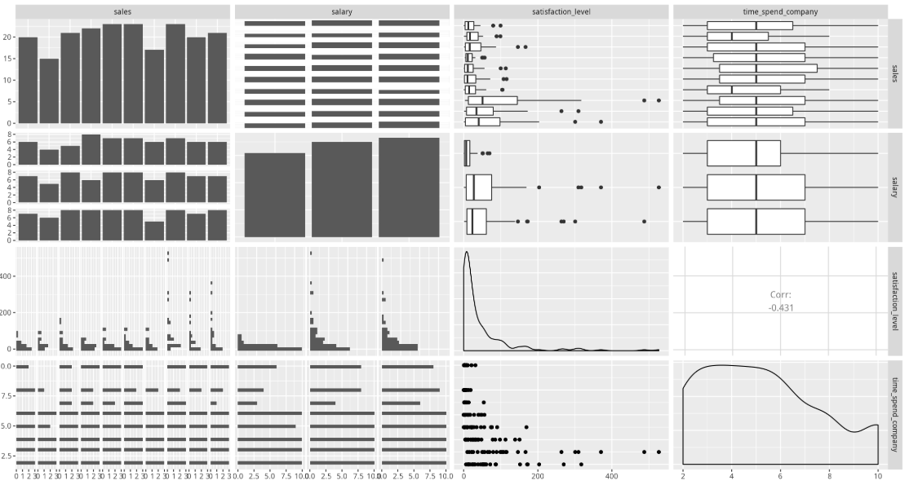

# R における Power BI カスタムビジュアルの作成方法

前回は R + Plotly の組み合わせによるカスタム ビジュアルを作成しました。これは Plotly が「R スクリプト ビジュアル」で直接コードして可視化することができないため、カスタム ビジュアルのパッケージとして作成する必要がありました。
しかし R の場合はどうでしょうか？ R の場合は「R スクリプト ビジュアル」が利用できるので、通常パッケージ化は必要ありません。ですが、これはあくまで R 言語を記述できる方が利用する場合の話であり、コーディングができない方では利用できないことに変わりはありません。また、Power BI Desktop では R スクリプトが利用できますが、現在Power BI Service では「R スクリプト ビジュアル」を利用することができません。
そこで R スクリプトのパッケージ化が必要になります。パッケージ化を行うと、以下のような利点があります。

- 毎回 R スクリプトを記述する必要がない
- パッケージ化されているので、組織内で統一されたコードでビジュアルが利用できる
- 細かいパラメータの設定も GUI で設定可能

今回の R でのカスタム ビジュアルは、上記の利点をフルに生かせるようなパッケージの作成方法を説明いたします。

前回と同じですが、Rについての日本語での解説は [こちら](http://www.okadajp.org/RWiki/?R%E3%81%A8%E3%81%AF) のページをご覧ください。

## Power BI における R の制限事項

[このページ](https://docs.microsoft.com/ja-jp/power-bi/desktop-r-visuals#known-limitations) に詳細が記載されていますが、Power BI Desktop で R を利用する場合には以下のような制限事項があります。Desktop 版と Service 版で若干制限事項が異なるので、両方ご利用される場合には厳しい制限に合わせる必要があります。Service 版の制限事項は[こちら](https://docs.microsoft.com/ja-jp/power-bi/service-r-visuals#known-limitations)に記載されております。

### Power BI Desktop、Serivce 共通

- R ビジュアルは他のビジュアル同様、データ更新、フィルター処理、および強調表示の際に反映されます。これは毎回 R スクリプトが処理されることを意味します。
- R ビジュアルは対話的にクロス フィルター処理のソースになることはできません。これは Plotly を利用しても同様で、フィルタ処理のソースは Power BI ネイティブなスライダーなどをご利用ください。同様に R のビジュアル要素をクリックして選択することはできません（これは Plotly を利用する場合を除きます。ホバー ヒントなどを利用してポイントの数値を取得したい場合には、Plotly の採用を検討してください）
- R ビジュアルでプロット可能なデータ量は 150,000 行までとなります。150,000 行を超えた分は表示されず、プロット イメージ上に警告が表示されます
- コンソールと対話的な動きをするパッケージや、コンソールへの動作に介入する（例えば「progress」パッケージを使うなど）パッケージは動作できません
- 日本語のカラム名は R では正常の動作しないことが多いので、英語のカラム名にすることをお勧めします。ただしどうしても日本語で表示を行いたいときには、以下の方法をお試しください

1. R スクリプト内で library を定義する箇所に以下のパッケージを読み込む行を追加する

Desktop の場合 `install.packages("showtext")`
Service の場合 `library("showtext")`

2. 続けて Power BI で `showtext` が利用できるように以下の行を実コード部分の先頭に配置する

`powerbi_rEnableShowTextForCJKLanguages =  1`

### Power BI Desktop での制限事項

- R での計算時間は 5 分までとなります。 5 分を超えるとエラーとなり、プロットできません
- R の既定のディスプレイ デバイスにプロットされるプロットだけが正しく表示されます。 異なる R ディスプレイ デバイスを明示的に使用することは避けてください。これは分かりにくいと思いますが、例えば「rggobi」のような、gtk+ を利用してインタラクティブにデータ探索を行えるモジュールがあります。これは gtk+ を利用して別ディスプレイ デバイスにデータを渡して処理を行います。このようなパッケージを Power BI 上で利用することはできません
- 32bit 版 Power BI では R のインストール パスを手動で入力する必要があります（2018年7月現在）

### Power BI Serviceでの制限事項

- 利用できるパッケージは「CRAN」のような公式リポジトリに登録されている必要があります。最新の対応 R パッケージは[こちら](https://docs.microsoft.com/ja-jp/power-bi/service-r-packages-support)から確認することが可能です。
- Power BI Service では R の計算時間は 60 秒までに制限されます。 60 秒を超えるとエラーとなり、プロットできません
- time データ型はサポートされません。Date/Time型をご利用ください
- 「Web に公開」を使用するとき、R ビジュアルは表示されません
- 2018年7月現在、R ビジュアルはダッシュボードとレポートの印刷機能では印刷されません
- 2018年7月現在、R ビジュアルは Analysis Services の DirectQuery モードでサポートされていません

## 2. 作業の流れ

作業の流れは前回とほとんど変わりません。ここでは環境ができている前提として以下の流れで進めていきます。

1. pbibiz new でのプロジェクトの作成
2. R によるコードの記述
3. pbiviz start によるビジュアル サーバーの起動
4. Power BI Service でのテスト実施
5. pbiviz package によるパッケージに作成
6. パッケージのインストール

## 3. カスタム ビジュアル プロジェクトの作成

前回は RHTML テンプレートでの「カスタム ビジュアル プロジェクト」を作成しましたが、今回は R ビジュアルのテンプレートを利用します。

`pbiviz new <プロジェクト名> -t rvisual`

---

1. コマンド プロンプトを起動し、プロジェクトを作成するディレクトリ（プロジェクト用ディレクトリは自動作成されるので作成は不要です）に移動します。

---

2. 以下の Node.js コマンドを実行します。今回はデフォルトの Power BI には無い「SPLOM」という複数の散布図（Scatter Plot）の集合体を作成します。ここでは名前は「pbisplom」とします。

`pbiviz new pbisplom -t rvisual`

実行が完了すると以下のように表示されます。

```
 info   Creating new visual
 info   Installing packages...
 info   Installed packages.
 done   Visual creation complete
  ```

---

3. 新しく作成されたディレクトリ（ここでは pbisplom ）に移動します。

`cd pbisplom`

---

4. Visual Server を起動します。

`pbiviz start`

起動が成功すると以下のようなメッセージが表示され、待機状態になります。

```
 info   Building visual...
 done   build complete

 info   Starting server...
 info   Server listening on port 8080.
```

これで Power BI Service からカスタム ビジュアルを使用できるようになりました。
作成後のファイル構成は以下のようになっているはずです。

```cmd:dir
.api
.npmignore
.vscode
assets
capabilities.json
dependencies.json
node_modules
package-lock.json
package.json
pbiviz.json
script.r
src
style
tsconfig.json
tslint.json
```

今回は `script.r` を編集していきます。

---

5. Power BI Service で適当なデータからレポートを作成します。サンプルからデータを取得しても構いませんし、作成済みのデータがあればそれを使用しても構いません。 

---

6. 空のレポートに対して下図にある「開発者向けビジュアル」をクリックします。



---

7. Plotly の場合とは異なり、データは組み込まれていないので、適当なデータをビジュアルに投入します。



これで初期動作の確認は完了です。

## 5. カスタム ビジュアルの作成

ここから R のグラフを開発します。
前回は VCS を使用して開発を行いましたが、今回は R Studio を使用して開発を行います。R Studioは[こちら](https://www.rstudio.com/products/rstudio/download/#download)からダウンロードし、インストールしてください。

---

1. R Studio で 先ほど作成したプロジェクト内の script.r を開きます。以下のように表示されるはずです。

```
plot(Values);
```

R のみの場合は非常に単純です。前回同様データは「Values」という変数に代入されていることがわかります。
plot は R のデフォルトのプロット命令です。実はこれでも SPLOM という形式の表示ができるのですが、あくまで散布図だけの対応なので、もっと色々なグラフが表示できるパッケージに変えていきましょう。

---

2. ここでは「[GGally](https://ggobi.github.io/ggally/)」という SPLOM のパッケージを使用します。GGally は [The GGobi Foundation, Inc](http://ggobi.org/foundation/) という団体が作成している ggplot2 の拡張機能です。もともと [GGobi](http://ggobi.org/) 自体も高次元のデータの可視化や探索を得意とするソフトウェアであり、R で利用可能なパッケージ（rggoib）もあるのですが、こちらは GGobi と R を接続するためのパッケージでしかなく、今回の Power BI で使用方法の場合には利用することができません（別の画面が開いて実行される形式となり、Power BI ではサポートされません）。


GGobiを使ったデータ可視化例

以下に GGally を利用するためのコードを記載します。

```
################# DEBUG in RStudio #################
setwd("C:/<WorkDir>")
Values <- read.csv("<CSV Data File>", sep = ",")
fileRda = "C:/Users/<UserName>/AppData/Local/Temp/tempData.Rda"
if(file.exists(dirname(fileRda)))
{
 if(Sys.getenv("RSTUDIO")!="")
   load(file= fileRda)
 else
   save(list = ls(all.names = TRUE), file=fileRda)
}
####################################################

############### Library Declarations ###############
library("showtext")
#library("progress") <- This moduele not compatible PBI Service
library("scales")
library("colorspace")
library("GGally")
####################################################

################### Actual code ####################
powerbi_rEnableShowTextForCJKLanguages =  1
ggp = ggpairs(Values)
print(ggp, progress = F)
####################################################
```

今回は DEBUG in RStudio の部分を利用します。本来は「fileRda」の部分以降がドキュメントで記載されている部分となりますが、一部使いにくい部分があるので2行ほど追加しています。1行目の `setwd` は作業ディレクトリの場所指定です。ここではコード、ファイルがある場所をしていします。2行目の `Values` は Power BI で読み込まれた際に指定される変数です。R Studio では事前に指定してデータを読み込む必要があります。
3行目の `fileRDA` はそのディレクトリにあるファイル一覧をバイナリ形式で保存するもののようです。こちらは内部的に使用されるようですが、最初に R Studio で実行するとエラーが発生（この Rda ファイルを置くディレクトリが存在しないため）してしまうので、事前にディレクトリまでは作成しておきます。

次に2個目の段落である Library Declarations を見てみましょう。一行目の `showtext` は Power BI で日本語カラムを使用する際に必要なライブラリです。2行目から5行目までが必要なライブラリですが、`progress` というライブラリは注意が必要です。これは重い処理を行う際にコンソール側に `=` 記号で進捗状況を表示するライブラリです。Power BI ではコンソール側で出力をや処理を行うパッケージはサポートされない（読み込もうとすると存在しないというエラーが発生する）ので、ここではコメントしておきます。

そして最後の段落 Actual code です。こちらも一行目は CJK 言語（C:中国語、J:日本語、K:韓国語）で書かれたカラム名の処理についての記述です。
2行目と3行目で一つのセットになって GGally の出力を形成していることに注意してください。2行目のみでも記述は可能なのですが、実は2行目だけで実行した場合、重い処理（15プロット以上 = 4x4の変数によるプロット以上の場合）を実行する際に先ほどの `progress` モジュールが要求されます。それを無効化しているのが3行目の `progress = F` の部分となります。

---

3. 上記のコードを R Studio で実行してみましょう。プロットの画面に以下ようなグラフが表示されます。



---

4. 上記のように、プロットはモノクロで表示されます。これでは味気ありませんので、特定のカラムのデータを利用して色付けしてみましょう。下記のコード例を利用して色で区分します。区分用のカラムは連続値データではなく、離散値データを利用しましょう

`ggp = ggpairs(Values, mapping = aes(colour = Values[,10]))`

上記では例として Values というデータの10個目のカラムを色付け用データとして利用しています。このデータは三段階の離散値を使用していますので、以下のような色付けになります。



これで3色に色付けされることがわかりました。色分けをするにはカラム名を指定する必要があり、コードに事前定義するのが難しいので、ここでは一旦元のコードに戻します。

---

5. コードを元に戻し、DEBUG in RStudio の部分をコメント化します。完了後保存し、以下のコマンドをコマンド プロンプトで実行します。

`pbiviz start`

---

6. 再び Power BI Service の画面にもどり、グラフを確認します。先ほど開発者向けビジュアルにデータを投入済みの方は画面の更新が完了するとともに GGally による SPLOM が表示されているはずです。まだデータを投入されていない方は、レポート上のビジュアルを選択後、表示したいデータ選択してください。例として以下のように SPLOM が表示されるはずです。




```
 info   RScript change detected. Rebuilding...
 done   RScript build complete
 ```

 これは `pbiviz` サーバーが自動的に変更を検知してビルドすることで開発効率を高める仕組みです。もし動作しない場合には先ほどの `package` コマンドを手動で実行し、サーバーを再起動してください。

---

 1. ここでダッシュボード上の「ビジュアル コードの再読み込み」をクリックします。ここでは3個のデータが必要にも関わらず2個のデータ（先ほどの状態であれば）しかないため、「ランタイムエラー」が発生しています。


このエラーの対処方法は後ほど解説しますので、ここではもう一つの数値データを「Values」欄にドラッグ＆ドロップします。これで以下のように画面が変わるはずです。


---

 7. たった2行のコードを追加するだけで、簡単にグラフを変えることができました。しかし先ほどのエラーのように、3軸のデータが必要な場合にデータ数が少ないとエラーが表示されるのは問題ですので、以下のようなコードを追加してみましょう。

```
source('./r_files/flatten_HTML.r')

############### Library Declarations ###############
libraryRequireInstall("ggplot2")
libraryRequireInstall("plotly")
####################################################

####### Validate number of columns and rows ########
pbiWarning <- NULL
# filter out non-numeric columns and constant columns (Should be comment if not use column test)
# correctColumn <- function(someColumn) { is.numeric(someColumn) && length(unique(someColumn)) > 1 }
# useColumns <- sapply(Values,correctColumn)
# if(sum(useColumns) < ncol(Values))
#   pbiWarning <- "Filtered out non numeric columns and constant columns"
# 
# Values <- as.data.frame(Values[,useColumns])

# filter out < 2 columns and < 2 columns
columnCount <- ncol(Values)
rowCount <- nrow(Values)

if (rowCount < 2 || columnCount < 3) {
  pbiWarning <- paste(pbiWarning, "<br><br>", "Not enough input dimensions");

# Plot error message to ggplot and convert to Plotly
  gg = ggplot()
  gg = gg + labs (title = pbiWarning, caption = NULL) + theme_bw() +
    theme(plot.title=element_text(hjust = 0.5, size = 20),
          axis.title=element_text(size =  11),
          axis.text=element_text(size =  8),
          panel.border = element_blank())
  p <- plotly_build(gg)
  internalSaveWidget(p, 'out.html')
  quit()
}
####################################################

################### Actual code ####################
p = plot_ly(Values,
            x = Values[,1],
            y = Values[,2],
            z = Values[,3],
            type = "heatmap"
)
####################################################

############# Create and save widget ###############
internalSaveWidget(p, 'out.html')
####################################################
```

ここでは「ggplot」が再び登場しているのがお分かりかと思います。これは Power BI が最終出力をグラフのオブジェクトしか受け取らないことと、Plotlyの出力内容に関係しています。もしエラーメッセージをそのままテキストで出力できれば特に何も問題ないのですが、Power BI では受け付けてくれません。また Plotly は様々なグラフを簡単に出力するには非常に良いのですが、例えば今回のエラーのように軸やデータを何も表示せずにテキストのみを表示することはできません。そのため今回 ggplot で出力した内容を更に `plotly_build` を使用して Plotly 形式のグラフとして出力しています。
また R 標準の `plot` も、今回の RHTML 形式ではウィジェット保存ができないため、対応できません。
もちろん軸やその他が表示されてもいいので、コードをなるべくシンプルにしたい場合には `Plotly` で記述しても動作します。

今回はセクションとして Validate number of columns and rows というコメントの部分を追加し、この中にコードを書きました。ブロックとしては、

- エラーメッセージの初期化
- 数値カラム以外のカラムの削除とエラー表示設定
- 特定の数値以下の行、列をエラーとする
- エラーメッセージの出力

の4つで構成されています。今回は文字列カラムも使用するので2個目のブロックはコメント化しています。
3つ目のブロックで3カラム未満の場合をエラーとしています。これはヒートマップは3次元のデータを必要としているからです。もしこれがヒストグラムであれば1未満、散布図であれば2未満というようにパラメータを変更する必要があります。
最後のブロックで `quit()` でコードを終了させていることにも注意が必要です。もし終了しなかった場合、後続のコードが実行されるため、エラーが表示されることになります。

---

8. それではこのコードを保存し、自動コンバートされたことを確認し、グラフをリロードしてみましょう。リロードが成功すると、特に先ほどと変わらない画面が表示されますので、データを1つ取り除きます。グラフが再度読み込まれ、以下のような画面に変わるはずです。


---

9. 再び取り除いたデータを戻し、元通り動作することも確認します。


---

10. 動作確認が完了したら、このビジュアルをパッケージ化して Power BI Desktop でも使用できるようにしましょう。カスタム ビジュアルとしてちゃんと認識できるように、アイコンの設定をしましょう。カスタム ビジュアルで使用できるアイコンのサンプルが、

`assets\icon.png`

に配置されていますので、それを変更しましょう。ここでは以下のようなアイコンにしました。
アイコンのサイズは 20x20 と非常に小さいので注意しましょう。


同じ場所、同じ名前で png 形式で保存します。

---

11. 保存が完了したら、パッケージ化を行います。以下のコマンドを実行してパッケージを作成します。

`pbiviz package`

問題が無ければ、以下のように表示されて完了します。

```
 info   Building visual...
 done   packaging complete
```
---

12. パッケージ化されたファイルを確認しましょう。パッケージは以下の場所に格納されます。

`dist\<プロジェクト名>.pbiviz`

このファイルを Power BI Desktop で読み込み、動作を確認します。

---

13. Power BI Desktop を起動します。もしお持ちでない方は Power BI の製品ページからダウンロードしてください。起動後、「視覚化」メニューから「カスタム ビジュアルのインポート」アイコンをクリックします（・・・というアイコンです）。


---

14. メニューが開くので「ファイルからインポートする」をクリックします。「プライバシーに関するリスク」警告が表示される場合がありますので、内容を確認の上「インポート」をクリックします。


---

15. 先ほどパッケージ化したファイルを選びます。正常にインポートされると「正常にインポートされました」という内容のダイアログが表示されます。


---

16. 先ほど作成したアイコンでパッケージが追加されていることを確認します。


---

17. Power BI Service での動作確認時と同じ動作が行われるか確認します。


---

これで R と Plotly を使用したカスタム ビジュアルの作成は完了です。Microsoft 自体も様々な同様のカスタム ビジュアルを Github にて公開していますので、ビジュアル開発の一助にご利用頂ければと思います。

[Microsoft の Github リポジトリ （R を利用したカスタム ビジュアルのみ）](https://github.com/search?l=R&q=microsoft%2Fpowerbi-visuals-&type=Repositories)