# R における Power BI カスタムビジュアルの作成方法

[前回](https://github.com/c-nova/pbipltly)は R + Plotly の組み合わせによるカスタム ビジュアルを作成しました。これは Plotly が「R スクリプト ビジュアル」で直接コードして可視化することができないため、カスタム ビジュアルのパッケージとして作成する必要がありました。
しかし R の場合はどうでしょうか？ R の場合は「R スクリプト ビジュアル」が利用できるので、通常パッケージ化は必要ありません。ですが、これはあくまで R 言語を記述できる方が利用する場合の話であり、コーディングができない方では利用できないことに変わりはありません。また、Power BI Desktop では R スクリプトが利用できますが、現在Power BI Service では「R スクリプト ビジュアル」を利用することができません。
そこで R スクリプトのパッケージ化が必要になります。パッケージ化を行うと、以下のような利点があります。

- 毎回 R スクリプトを記述する必要がない
- パッケージ化されているので、組織内で統一されたコードでビジュアルが利用できる
- 細かいパラメータの設定も GUI で設定可能

今回の R でのカスタム ビジュアルは、上記の利点をフルに生かせるようなパッケージの作成方法を説明いたします。

[前回](https://github.com/c-nova/pbipltly)と同じですが、Rについての日本語での解説は [こちら](http://www.okadajp.org/RWiki/?R%E3%81%A8%E3%81%AF) のページをご覧ください。

## 1. Power BI における R の制限事項

[このページ](https://docs.microsoft.com/ja-jp/power-bi/desktop-r-visuals#known-limitations) に詳細が記載されていますが、Power BI Desktop で R を利用する場合には以下のような制限事項があります。Desktop 版と Service 版で若干制限事項が異なるので、両方ご利用される場合には厳しい制限に合わせる必要があります。Service 版の制限事項は[こちら](https://docs.microsoft.com/ja-jp/power-bi/service-r-visuals#known-limitations)に記載されております。

### Power BI Desktop、Serivce 共通

- R ビジュアルは他のビジュアル同様、データ更新、フィルター処理、および強調表示の際に反映されます。これは毎回 R スクリプトが処理されることを意味します。
- R ビジュアルは対話的にクロス フィルター処理のソースになることはできません。これは Plotly を利用しても同様で、フィルタ処理のソースは Power BI ネイティブなスライダーなどをご利用ください。同様に R のビジュアル要素をクリックして選択することはできません（これは Plotly を利用する場合を除きます。ホバー ヒントなどを利用してポイントの数値を取得したい場合には、Plotly の採用を検討してください）
- R ビジュアルでプロット可能なデータ量は 150,000 行までとなります。150,000 行を超えた分は表示されず、プロット イメージ上に警告が表示されます
- コンソールと対話的な動きをするパッケージや、コンソールへの動作に介入する（例えば「progress」パッケージを使うなど）パッケージは動作できません
- 日本語のカラム名は R では正常の動作しないことが多いので、英語のカラム名にすることをお勧めします。ただしどうしても日本語で表示を行いたいときには、以下の方法をお試しください

1. R スクリプト内で library を定義する箇所に以下のパッケージを読み込む行を追加する

Desktop の場合 `install.packages("showtext")`
Service の場合 `library("showtext")`

2. 続けて Power BI で `showtext` が利用できるように以下の行を実コード部分の先頭に配置する

`powerbi_rEnableShowTextForCJKLanguages =  1`

### Power BI Desktop での制限事項

- R での計算時間は 5 分までとなります。 5 分を超えるとエラーとなり、プロットできません
- R の既定のディスプレイ デバイスにプロットされるプロットだけが正しく表示されます。 異なる R ディスプレイ デバイスを明示的に使用することは避けてください。これは分かりにくいと思いますが、例えば「rggobi」のような、gtk+ を利用してインタラクティブにデータ探索を行えるモジュールがあります。これは gtk+ を利用して別ディスプレイ デバイスにデータを渡して処理を行います。このようなパッケージを Power BI 上で利用することはできません
- 32bit 版 Power BI では R のインストール パスを手動で入力する必要があります（2018年7月現在）

### Power BI Serviceでの制限事項

- 利用できるパッケージは「CRAN」のような公式リポジトリに登録されている必要があります。最新の対応 R パッケージは[こちら](https://docs.microsoft.com/ja-jp/power-bi/service-r-packages-support)から確認することが可能です。
- Power BI Service では R の計算時間は 60 秒までに制限されます。 60 秒を超えるとエラーとなり、プロットできません
- time データ型はサポートされません。Date/Time型をご利用ください
- 「Web に公開」を使用するとき、R ビジュアルは表示されません
- 2018年7月現在、R ビジュアルはダッシュボードとレポートの印刷機能では印刷されません
- 2018年7月現在、R ビジュアルは Analysis Services の DirectQuery モードでサポートされていません

## 2. 作業の流れ

作業の流れは前回とほとんど変わりません。ここでは環境ができている前提として以下の流れで進めていきます。

1. pbibiz new でのプロジェクトの作成
2. R によるコードの記述
3. pbiviz start によるビジュアル サーバーの起動
4. Power BI Service でのテスト実施
5. pbiviz package によるパッケージに作成
6. パッケージのインストール

## 3. カスタム ビジュアル プロジェクトの作成

前回は RHTML テンプレートでの「カスタム ビジュアル プロジェクト」を作成しましたが、今回は R ビジュアルのテンプレートを利用します。

`pbiviz new <プロジェクト名> -t rvisual`

---

1. コマンド プロンプトを起動し、プロジェクトを作成するディレクトリ（プロジェクト用ディレクトリは自動作成されるので作成は不要です）に移動します。

---

2. 以下の Node.js コマンドを実行します。今回はデフォルトの Power BI には無い「SPLOM」という複数の散布図（Scatter Plot）の集合体を作成します。ここでは名前は「pbisplom」とします。

`pbiviz new pbisplom -t rvisual`

実行が完了すると以下のように表示されます。

```
 info   Creating new visual
 info   Installing packages...
 info   Installed packages.
 done   Visual creation complete
  ```

---

3. 新しく作成されたディレクトリ（ここでは pbisplom ）に移動します。

`cd pbisplom`

---

4. Visual Server を起動します。

`pbiviz start`

起動が成功すると以下のようなメッセージが表示され、待機状態になります。

```
 info   Building visual...
 done   build complete

 info   Starting server...
 info   Server listening on port 8080.
```

これで Power BI Service からカスタム ビジュアルを使用できるようになりました。
作成後のファイル構成は以下のようになっているはずです。

```cmd:dir
.api
.npmignore
.vscode
assets
capabilities.json
dependencies.json
node_modules
package-lock.json
package.json
pbiviz.json
script.r
src
style
tsconfig.json
tslint.json
```

今回は `script.r` を編集していきます。

---

5. Power BI Service で適当なデータからレポートを作成します。サンプルからデータを取得しても構いませんし、作成済みのデータがあればそれを使用しても構いません。 

---

6. 空のレポートに対して下図にある「開発者向けビジュアル」をクリックします。


---

7. Plotly の場合とは異なり、データは組み込まれていないので、適当なデータをビジュアルに投入します。

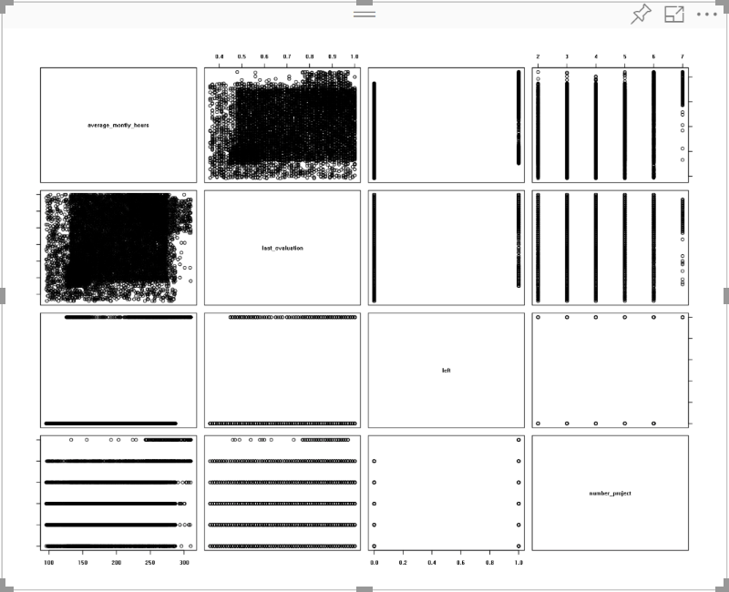

これで初期動作の確認は完了です。

## 4. 基本的なプロット

ここから R のグラフを開発します。
前回は VCS を使用して開発を行いましたが、最初の R のコーディング部分は R Studio を使用して開発を行います。R Studioは[こちら](https://www.rstudio.com/products/rstudio/download/#download)からダウンロードし、インストールしてください。

---

1. R Studio で 先ほど作成したプロジェクト内の script.r を開きます。以下のように表示されるはずです。

```
plot(Values);
```

R のみの場合は非常に単純です。前回同様データは「Values」という変数に代入されていることがわかります。
plot は R のデフォルトのプロット命令です。実はこれでも SPLOM という形式の表示ができるのですが、あくまで散布図だけの対応なので、もっと色々なグラフが表示できるパッケージに変えていきましょう。

---

2. ここでは「[GGally](https://ggobi.github.io/ggally/)」という SPLOM のパッケージを使用します。GGally は [The GGobi Foundation, Inc](http://ggobi.org/foundation/) という団体が作成している ggplot2 の拡張機能です。もともと [GGobi](http://ggobi.org/) 自体も高次元のデータの可視化や探索を得意とするソフトウェアであり、R で利用可能なパッケージ（rggoib）もあるのですが、こちらは GGobi と R を接続するためのパッケージでしかなく、今回の Power BI で使用方法の場合には利用することができません（別の画面が開いて実行される形式となり、Power BI ではサポートされません）。

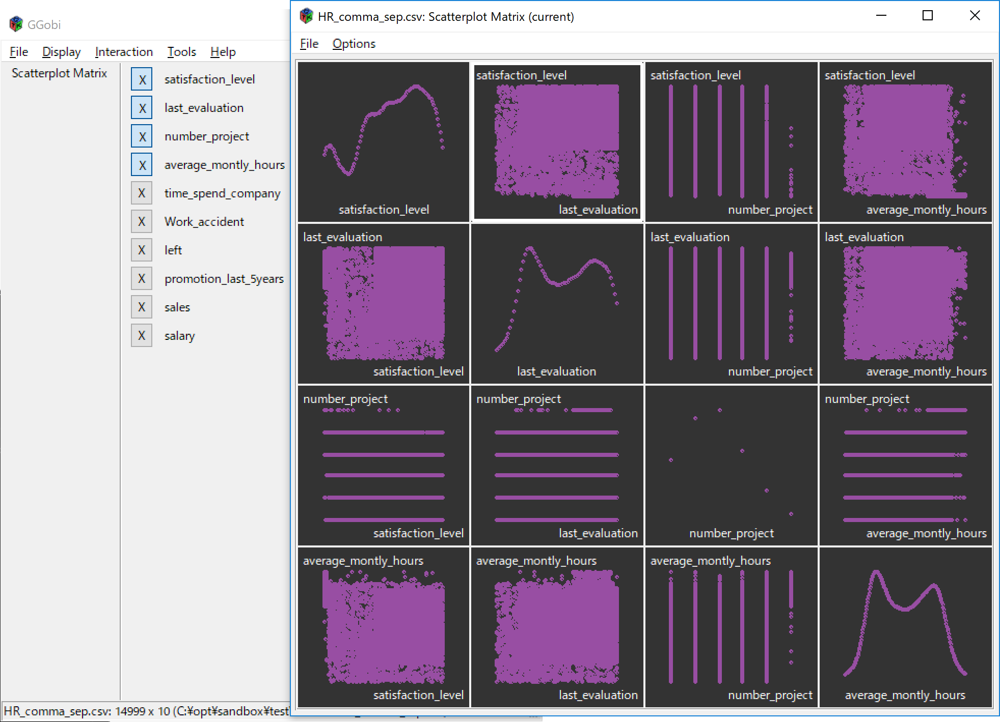
GGobiを使ったデータ可視化例

以下に GGally を利用するためのコードを記載します。

```
################# DEBUG in RStudio #################
setwd("C:/<WorkDir>")
Values <- read.csv("<CSV Data File>", sep = ",")
fileRda = "C:/Users/<UserName>/AppData/Local/Temp/tempData.Rda"
if(file.exists(dirname(fileRda)))
{
 if(Sys.getenv("RSTUDIO")!="")
   load(file= fileRda)
 else
   save(list = ls(all.names = TRUE), file=fileRda)
}
####################################################

############### Library Declarations ###############
library("showtext")
#library("progress") <- This moduele not compatible PBI Service
library("scales")
library("colorspace")
library("GGally")
####################################################

################### Actual code ####################
powerbi_rEnableShowTextForCJKLanguages =  1
ggp = ggpairs(Values)
print(ggp, progress = F)
####################################################
```

今回は DEBUG in RStudio の部分を利用します。本来は「fileRda」の部分以降がドキュメントで記載されている部分となりますが、一部使いにくい部分があるので2行ほど追加しています。1行目の `setwd` は作業ディレクトリの場所指定です。ここではコード、ファイルがある場所をしていします。2行目の `Values` は Power BI で読み込まれた際に指定される変数です。R Studio では事前に指定してデータを読み込む必要があります。
3行目の `fileRDA` はそのディレクトリにあるファイル一覧をバイナリ形式で保存するもののようです。こちらは内部的に使用されるようですが、最初に R Studio で実行するとエラーが発生（この Rda ファイルを置くディレクトリが存在しないため）してしまうので、事前にディレクトリまでは作成しておきます。

次に2個目の段落である Library Declarations を見てみましょう。一行目の `showtext` は Power BI で日本語カラムを使用する際に必要なライブラリです。2行目から5行目までが必要なライブラリですが、`progress` というライブラリは注意が必要です。これは重い処理を行う際にコンソール側に `=` 記号で進捗状況を表示するライブラリです。Power BI ではコンソール側で出力をや処理を行うパッケージはサポートされない（読み込もうとすると存在しないというエラーが発生する）ので、ここではコメントしておきます。

そして最後の段落 Actual code です。こちらも一行目は CJK 言語（C:中国語、J:日本語、K:韓国語）で書かれたカラム名の処理についての記述です。
2行目と3行目で一つのセットになって GGally の出力を形成していることに注意してください。2行目のみでも記述は可能なのですが、実は2行目だけで実行した場合、重い処理（15プロット以上 = 4x4の変数によるプロット以上の場合）を実行する際に先ほどの `progress` モジュールが要求されます。それを無効化しているのが3行目の `progress = F` の部分となります。

---

3. 上記のコードを R Studio で実行してみましょう。プロットの画面に以下ようなグラフが表示されます。

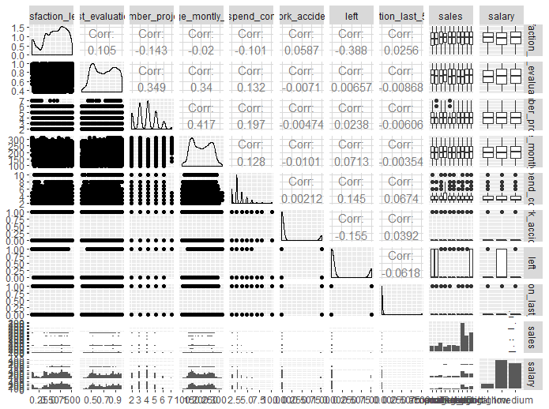

---

4. 上記のように、プロットはモノクロで表示されます。これでは味気ありませんので、特定のカラムのデータを利用して色付けしてみましょう。下記のコード例を利用して色で区分します。区分用のカラムは連続値データではなく、離散値データを利用しましょう

`ggp = ggpairs(Values, mapping = aes(colour = Values[,10]))`

上記では例として Values というデータの10個目のカラムを色付け用データとして利用しています。このデータは三段階の離散値を使用していますので、以下のような色付けになります。

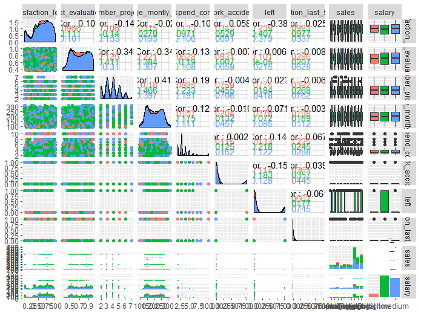

これで3色に色付けされることがわかりました。色分けをするにはカラム名を指定する必要があり、コードに事前定義するのが難しいので、ここでは一旦元のコードに戻します。

---

5. コードを元に戻し、DEBUG in RStudio の部分をコメント化します。完了後保存し、以下のコマンドをコマンド プロンプトで実行します。

`pbiviz start`

---

6. 再び Power BI Service の画面にもどり、グラフを確認します。先ほど開発者向けビジュアルにデータを投入済みの方は画面の更新が完了するとともに GGally による SPLOM が表示されているはずです。まだデータを投入されていない方は、レポート上のビジュアルを選択後、表示したいデータ選択してください。例として以下のように SPLOM が表示されるはずです。

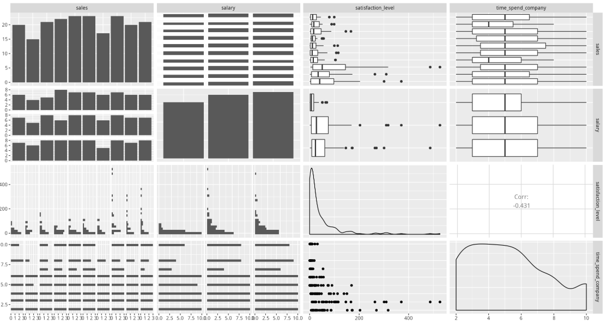


```
 info   RScript change detected. Rebuilding...
 done   RScript build complete
 ```

 R + Plotly の際と同様、 `pbiviz` サーバーが自動的に変更を検知してビルドし、サーバーが再起動します。ここで一番左のアイコンをクリックすると手動でリロードが可能ですが、細かく修正を行う場合には左から2番目の矢印付きのアイコンをクリックすると自動リロードモードになりますので、開発フェーズに合わせて設定を行ってください。


---

## 5. VSCの導入、準備
ここから先は R 以外のコードも実施する必要があるため、R Studio は一旦ここで終了し、Visual Studio Code（以下VSC）を使用してコーディングを行っていきます。早速環境を整えましょう。

1. [前回](https://github.com/c-nova/pbipltly)同様、VCSを起動します。お持ちでなければ[ここ](https://code.visualstudio.com/)からダウンロードして、インストールしてください。
2. 今回はちゃんと？ R のコードを書く必要があるため VSC に R のプラグインを導入します。画面左端上部の最下部にある四角いアイコンをクリックするか、「Ctrl+Shift+X」を押下します。
3. 「拡張機能」ウィンドウが表示されるので、最上部の検索ウィンドウで「R」と入力し、Enterを押下します。
4. R とだけ書かれたパッケージが見つかると思いますので、クリックして拡張機能パッケージの画面を開きます。

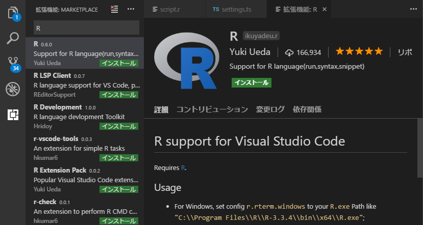

5. 上手のようなパッケージであることを確認し、インストールをクリックします。画面上部にある「拡張機能の識別子」が「ikuyadeu.r」であることも念のため確認しておきましょう。
6. インストールが完了したら「再読み込み」ボタンをクリックして再起動します。
7. 「Usage」にも書いてあるように「R のパス」を指定します。「ファイル」->「基本設定」->「設定」の順に開くか、「Ctrl+,」を押下します。
8. 設定画面が開くので、右側にある「ユーザー設定」の JSON 文字列に以下のように追記します。私の環境は Microsoft の Open R 3.5.0 を使用しておりますので以下のようになりますが、皆さんは自身の環境に合わせた内容で記述してください。

`"r.rterm.windows": "C:\\Program Files\\Microsoft\\R Open\\R-3.5.0\\bin\\x64\\R.exe"`

1行上の最後部に「,」を付与することを忘れないようにしましょう。
追記後、以下のような記述になります。

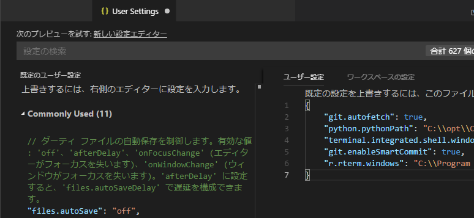

9. 設定を有効化するためにVSCを再起動します。
10. 再起動後、「ファイル」->「フォルダを開く」を開くか、「Ctrl+K -> Ctrl+O」を押下して先ほど作成したプロジェクト フォルダを開きます。
11. 左側のペインに「エクスプローラー」が表示されるので、先ほど作成した「script.r」ファイルをクリックします。
12. 画面上部にある下矢印付きアイコンをクリックするか、「Ctrl+Shift+S」を押下します。この操作により script.r 内のコードが全て実行されます。実行後、以下のような画面が別ウィンドウで表示されます。

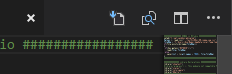
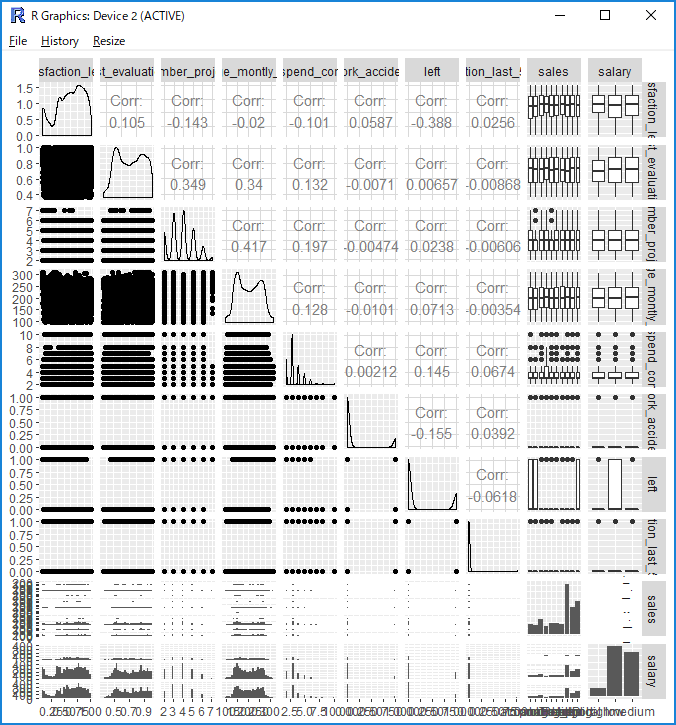

これでVSCの準備は完了です。

---

## 6. Power BI の機能を利用して色をつける
以前の章では R Studio では色のついたグラフが表示することができました。しかし R Studio での開発とは異なり、Power BI 上では定数を使ったカラムの指定を行うと毎回コードを変更する必要があり、非常に不便です。そこでこの章では Power BI の機能を利用して、ユーザーが自由にデータを投入して色を付けられるようにします。  

1. データを投入する項目を管理しているのは「capability.json」というファイルになります。このファイルは初期状態では以下のようになっています。この内容を見てみましょう。

```
{
  "dataRoles": [
    {
      "displayName": "Values",
      "kind": "GroupingOrMeasure",
      "name": "Values"
    }
  ],
  "dataViewMappings": [
    {
      "scriptResult": {
        "dataInput": {
          "table": {
            "rows": {
              "select": [
                {
                  "for": {
                    "in": "Values"
                  }
                }
              ],
              "dataReductionAlgorithm": {
                "top": {}
              }
            }
          }
        },
～～ 中略 ～～
}
```

入力データ項目を作成する上で注意が必要なのは、上記の「dataRoles」と「dataViewMappings」です。これはそれぞれ以下のような役割があります。

|  | dataRoles | dataViewMappings |
|:-|:---------:|:----------------:|
|役割| 入力項目の名称や受け入れる値に制約を加える|入力項目数を制限したり、dataRoles で入力された値の処理方法を決定する
|主な設定項目|表示名、ヒント文、受け入れデータ形式、内部名称|受け入れ最大/最小項目数、明細またはグループ化データの取り扱い方法|

ここではどのようにデータを受け入れているかを確認できます。まず目につくのは「dataRoles」内の「Values」の項目です。これは Power BI 上で R を使用する際にデフォルトで用意されているデータ投入項目です。「Kind」の部分を見ると「GroupingOrMeasure」となっているので、グループ化用の値も、明細の値もどちらも受け入れ可能になっています。

続いて「dataViewMappings」も見てみましょう。ここでも「Values」という値に注目しましょう。この項目は「scriptingResult」「dataInput」の下の「table」に格納されています。これは「table」というデータ処理機能を使用して「rows」に格納されることを意味します。簡単に言うとテーブル形式で行に格納されることになります。また「"for": { "in": 」を使用しているということで、集計、グループ化されず、そのままのデータを各行に入れるということになります。

まとめると、デフォルトで用意されている「Values」というデータの受け入れ項目はどのようなデータ形式でも、個数も制限なく受け入れ、すべて明細で表現される、ということになります。

ここでは全ての内容についての説明は難しいため、詳細は[公式の英語ページ](https://github.com/Microsoft/PowerBI-visuals/blob/master/Capabilities/Capabilities.md)か、[非公式の日本語ページ](https://qiita.com/kenakamu/items/46ae6e419c49284c75ed)をご覧のうえ、ご理解頂ければと思います。。

2. それではまず、「dataRoles」について変更を行いましょう。以下のように既存の内容の変更と、追加の項目を記述します。

```
"dataRoles": [
    {
      "displayName": "値",
      "description": "プロットする値を入力します。連続値、離散値が入力可能です",
      "kind": "GroupingOrMeasure",
      "name": "Values"
    },
    {
      "displayName": "カラー",
      "description": "プロットに色付けする値を入力します。離散値のみが入力可能です（15値まで）",
      "kind": "GroupingOrMeasure",
      "name": "ColorVal"
    }
  ],
```
最初に変更部分です。既存の「Values」という言葉も分かりにくいので「値」など日本語に変更できます。ただし変更するのは「displayName」のみで「name」は変更しないでください。こちらは内部で使用する名称となります。  
また「descriptions」という項目を増やしました。これは「値」の欄でマウス ポイントをホバー（何もクリックせず上に置いてあるだけの状態）した際に表示されるバルーン ヘルプのようなものです。これで投入するデータの種類などに注意を与えられます。

次にグラフに色付けを行うための項目を投入する「カラー」という部分を追記します。こちらも同様に「descriptsions」に注意事項を記入します。

変更、追記が終わったらファイルを保存します。

3. それでは早速どのように表示されるのか見てみましょう。統合コンソールが表示されていない場合には「表示」->「統合コンソール」をクリックするか、「Ctral+@」を押下します。もし前の章で R のコンソールを起動したままの場合は、コンソールに「quit()」と入力、実行して R のターミナルを閉じます。  
準備ができたら以下のコマンドを実行して pbiviz サーバーを起動します。

`pbiviz start`

4. Power BI サービスの画面を開きます。以下のように「値」という項目と「カラー」という項目が表示されていれば問題なく動作していることになります（ただしまだロジックは入れておりませんのでカラー表示はできません）。

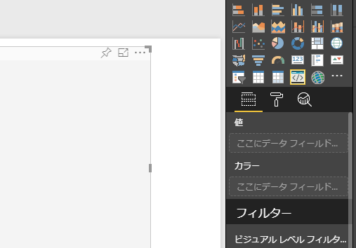

5. 続けて R のスクリプトにカラー化させる内容を記述してみましょう。以下の行を変更します。

`ggp = ggpairs(Values)`

以下の内容に変更します。R Studioの際にカラー化した際のコードを一部変更し、先ほど追加した「カラー」項目の内部名「ColorVal」にしました。

`ggp = ggpairs(Values, mapping = aes(color = ColorVal))`

6. これで実際に動作を見てみましょう。グラフを再読み込みしてみます。

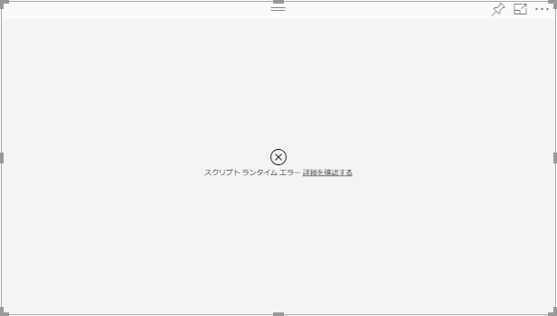

どうやらエラーのようです。このように R でカスタム ビジュアルを開発する際にはエラー表示はプロット画面のみで表示されますのでご注意ください。詳細は「詳細を確認する」リンクをクリックします。

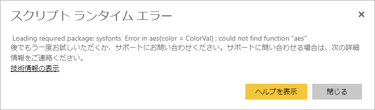

どうやら「aes」というファンクションが無いというエラーのようです。このように R Studio では表示されなかったエラーが表示されるということは、Power BI の R の処理が一般的な R と異なるということを示します。ここでは明示的に、

`library("ggplot2")`

という行を「Library Declarations」の部分に追記します。以下のようになっていれば問題ありません。

```
############### Library Declarations ###############
#library("progress") <- This moduele not compatible PBI Service
library("ggplot2")
library("showtext")
library("scales")
library("colorspace")
library("GGally")
####################################################
```

この状態でスクリプトを保存します。

7. それではもう一度再読み込みしてみましょう。恐らくもう一度エラーが表示されたかと思います。今度のエラー内容も見てみましょう。

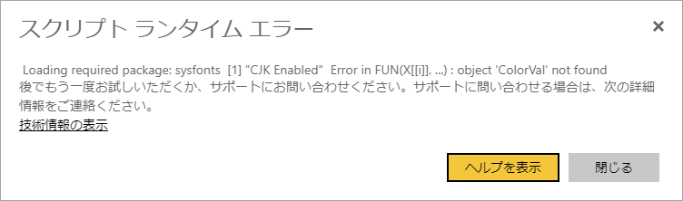

これは「ColorVal」が無いため処理できないというエラーです。これは先ほど作成した「カラー」の項目に何も入っていないと起きるエラーです。早速何か離散値のデータを投入します。

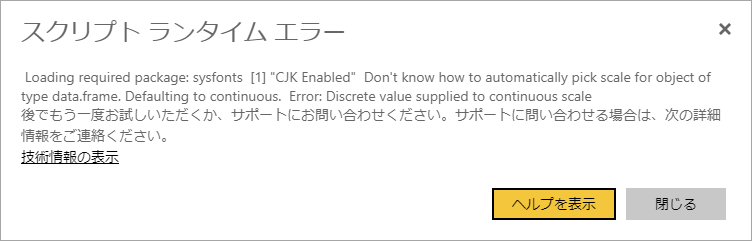

データを投入するとまたエラーが発生します。このエラーは連続値のスケールに離散値のデータが入っているため ggplot2 で処理方法が判断できないというものです。このように一見単純なデータを投入しているつもりでも、Power BI 内では目に見えない処理が行われているため、内部的にデータを制限する必要があります。

8. 早速コードを変更しましょう。「ColorVal」の最初のカラムだけを受け取り、別の変数に代入してみます。

`graphColor = ColorVal[,1]`

全体としては以下のようになっているはずです。

```
################### Actual code ####################
powerbi_rEnableShowTextForCJKLanguages =  1
graphColor = ColorVal[,1]
ggp = ggpairs(Values, mapping = aes(color = graphColor))
print(ggp, progress = F)
####################################################
```

それでは早速コードを保存して再読み込みしてみましょう。

9. うまくカラー化できたようです。しかし途中のエラーからもわかるように、R のコードはそのまま使用してしまうとエラーばかり発生してしまうことになります。続けてエラー ハンドリングも行っていきましょう。

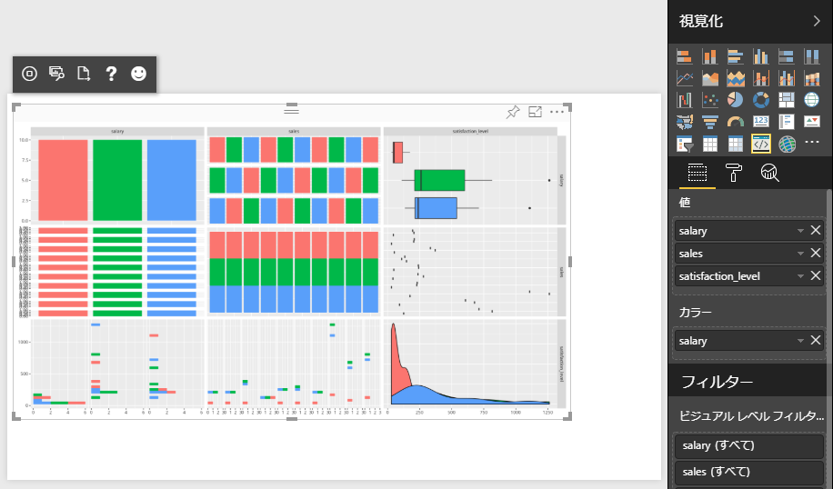

10. ここで一旦エラー内容と対応内容を整理しましょう。

|    項目    |              エラー内容               |
|:-----------|:-------------------------------------|
| 1. パッケージ | 依存関係のパッケージが自動的に呼び出されない |
| 2. 追加データ | データが追加されていない時に、定義されていない変数でエラーが起きる |
| 3. データ形式 | 投入データの中で明示的にカラムがしていされていない場合エラーが起きる時がある |

この中で1と3番目は既にハンドリング済みなので、これから2番目の内容を対応しましょう。

11. 変数の存在を確認するには `exists` という R の関数を使用します。例えば `ColorVal` という変数の存在を確認するには、

`exists("ColorVal")`

とすることで確認が可能です。それではこの内容を早速コードに組み込んでみましょう。

```
################### Actual code ####################
powerbi_rEnableShowTextForCJKLanguages =  1

if(exists("ColorVal")){
    graphColor = ColorVal[,1]
    ggp = ggpairs(Values, mapping = aes(color = graphColor))
} else {
    ggp = ggpairs(Values)
}

print(ggp, progress = F)
####################################################
```

上記のように if 文に exists を組み込んで、ColorVal がある場合にはカラー、無い場合にはモノクロと分岐させるコードを記述します。  
コードを記述したら保存します。

12. この状態で Power BI Service で実行しましょう。グラフを再読み込みします。


## 7. Power BI のオプションを機能を使用してプロットを構成する
前の章では色付け用のカラムを別に用意し、自由に色付けをできるようにしました。しかしこれだけでは GGally の利点である「グラフの種類を自由に組み合わせる」という機能が利用できません。ここでは Power BI のオプション機能を使用してプロットの構成を行えるようにします。

